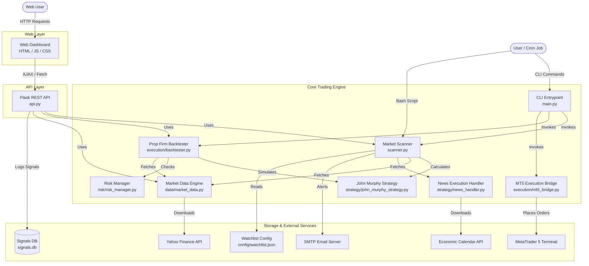

# System Architecture

The trading bot is composed of several distinct layers, allowing it to be run either as a standalone CLI application, a scheduled cron job, or an interactive web dashboard.

## High-Level Architecture Diagram

## Component Breakdown

### 1. Web Layer (`dashboard/`)
A lightweight, modern web frontend built with vanilla HTML, JavaScript (`app.js`), and CSS. It communicates with the Flask REST API to fetch live portfolio settings, request a real-time market scan, plot historical candle data, and run backtest simulations directly from the browser.

### 2. API Layer (`api.py`)
A Flask-based REST API that serves the static dashboard files and exposes key functionalities of the core trading engine to the web. It handles:
- Serving the single-page application.
- Exposing endpoints like `/api/scan`, `/api/backtest`, and `/api/candles`.
- Automatically logging any generated trade signals into an SQLite database (`signals.db`).

### 3. Core Trading Engine
The engine that can be invoked via the CLI (`main.py`), the API (`api.py`), or automated cron jobs (`run_scanner_cron.sh`).
- **Market Scanner:** The brain of the operation, iterating through the configured watchlist, fetching data, applying strategies, and generating signals.
- **Backtester:** A standalone simulation tool that evaluates the `John Murphy Strategy` against historical price data with strict risk management controls to determine profitability.
- **Strategy & Risk:** Encapsulates the indicator calculation (EMA 50/200, Support/Resistance) and strict position-sizing rules (1% risk, minimum 1:3 R:R).

### 4. Storage & External Integrations
- **Signals DB (`signals.db`):** An SQLite database created and maintained by the Flask API to track historical trade recommendations over time.
- **Watchlist Config (`config/watchlist.json`):** A customizable JSON file dictating which currency pairs and instruments the scanner should evaluate.
- **MetaTrader 5 Bridge:** Direct Python-to-MT5 connection for executing demo/live trades automatically.
- **External Data Sources:** Relies on Yahoo Finance for price action and external economic calendars for news events.
